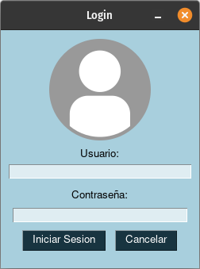
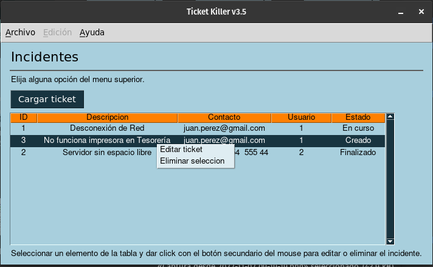
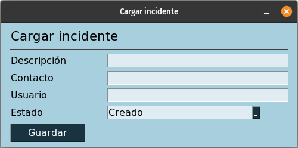
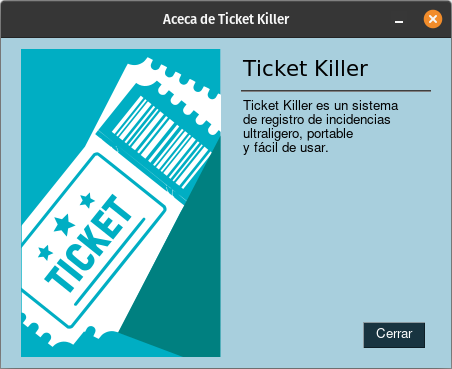

# Desarrollo de Aplicaciones de escritorio con python
Ejemplo de uso de la librería PySimpleGUI
Requiere python3, pip3, instancia de docker

## Contenedor de postgresql
```
cd postgres_ct
docker-compose up -d
```
Expone una instancia de postgresql en un contenedor docker, en el puerto 5432.
>Recordar crear un archivo .env con las variables de usuario y contraseña de postgres.
```
POSTGRES_USER=Mi_Usuario_Postgres
POSTGRES_PASSWORD=Mi_Password_Postgres
```

>Si ya se cuenta con una instalación de Postgresql, se puede omitir esta sección.

## Parámetros de la app
Crear o editar un archivo .env en la carpeta raíz de la aplicación con las siguientes variables:
```
DB_NAME = Nombre_de_DB
DB_USERNAME = Mi_Usurio_Postgres
DB_PASSWORD = Mi_Password_Postgres
```

## Creación de la Base de Datos
```
python3
from src import app
app.create()
quit()
```

## Creación de usuarios de prueba
```
python3
from src import app
app.seed_db()
quit()
```

## Instalación de dependencias
>Desde la carpeta del proyecto
```
pip3 install -r requirements.txt
```

## Ejecutando la app
```
python3 run.py
```





### Acceso a la app
>Los usuarios por default son:  
- admin  
- operador  
- consulta  